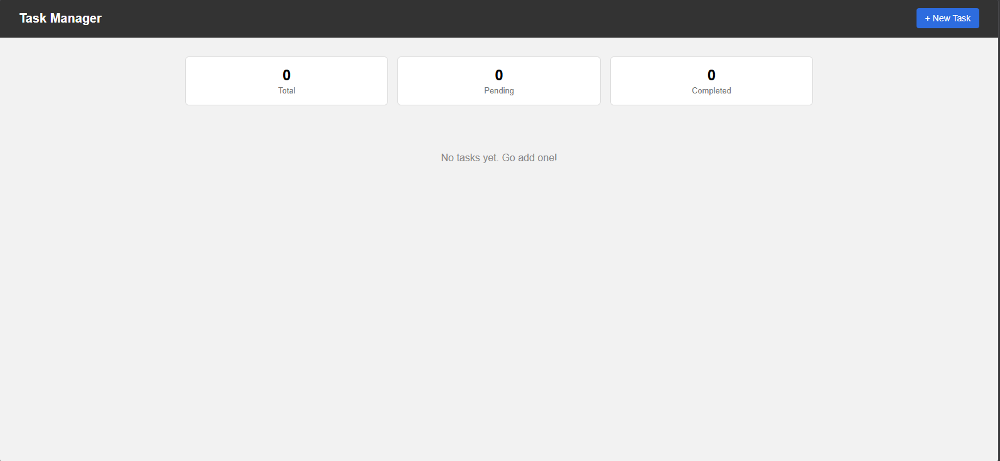
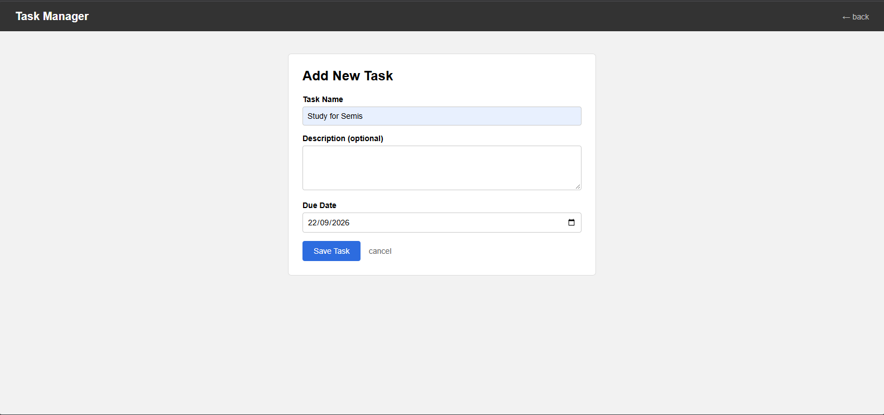
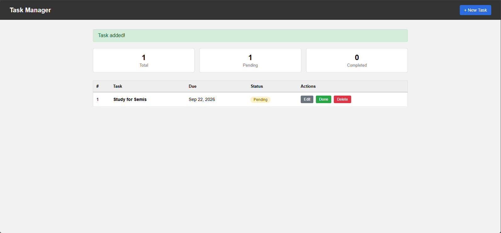

# Personal Task Manager

A simple and efficient web-based task management system built with Laravel and Supabase. This application allows users to organize daily tasks, monitor progress, and manage task completion through an intuitive interface.

## Project Information

**Project Code:** WST21-PM-2026-SF
**Student Name:** John Francis C. Primor
**Course & Year:** Bachelor of Science in Information Technology (BSIT) - 2nd Year, Section IT 2-Sec05
**Database:** Supabase (PostgreSQL)

---

## Overview

The Personal Task Manager is designed to help users keep track of their tasks and improve productivity. It provides essential task management functionalities such as creating, updating, deleting, and tracking task statuses.

---

## Features

* Create new tasks
* View all existing tasks
* Edit task details
* Delete tasks
* Mark tasks as Pending or Completed
* Responsive and user-friendly interface
* PostgreSQL database integration through Supabase

---

## Technology Stack

### Backend

* Laravel 13
* PHP 8.5

### Database

* PostgreSQL
* Supabase

### Frontend

* Blade Templates
* HTML5
* CSS3

---

## Screenshots

### 1. Dashboard (Empty State)
> The main dashboard on first load. Shows three summary cards - Total, Pending, and Completed - all starting at 0. Displays "No tasks yet. Go add one!" when no tasks exist.



---

### 2. Add New Task Form
> Clicking the "+ New Task" button navigates to this form. The user fills in a Task Name (required), an optional Description, and an optional Due Date, then clicks "Save Task" to submit.



---

### 3. Dashboard with Task Added
> After saving a task, the user is redirected back to the dashboard. A green "Task added!" banner confirms the action. The task appears in the list with its due date, a yellow "Pending" status badge, and Edit / Done / Delete action buttons.



---

## How It Works (Step-by-Step)

### Step 1 - Open the Application
Launch the app and you will land on the **Dashboard**. Three summary cards at the top display the count of **Total**, **Pending**, and **Completed** tasks. If no tasks have been added yet, the message "No tasks yet. Go add one!" is shown in the center.

### Step 2 - Add a New Task
Click the **"+ New Task"** button in the top-right corner of the navbar. You will be taken to the **Add New Task** form.

Fill in the following fields:
- **Task Name** *(required)* - A short description of what needs to be done (e.g., "Study for Semis")
- **Description** *(optional)* - Additional details or notes about the task
- **Due Date** *(optional)* - The deadline for the task

Click **"Save Task"** to save the task, or **"cancel"** to go back to the dashboard without saving.

### Step 3 - View Your Tasks
After saving, you are automatically redirected to the dashboard. A green **"Task added!"** flash message appears at the top confirming the action. The task now appears in the task table with the following columns:
- **#** - Row number
- **Task** - The task name displayed in bold
- **Due** - The due date (e.g., Sep 22, 2026)
- **Status** - A colored badge showing the current status ("Pending" in yellow)
- **Actions** - Three buttons: Edit (gray), Done (green), Delete (red)

The summary cards at the top update automatically to reflect the new task count.

### Step 4 - Mark a Task as Done
Click the green **"Done"** button next to any task. The status badge will change from **Pending** to **Completed**, and the Completed counter on the dashboard will increase by 1 while the Pending counter decreases by 1.

### Step 5 - Edit a Task
Click the gray **"Edit"** button next to a task. You will be taken back to the task form, pre-filled with the existing task data. Make your changes and click **"Save Task"** to update.

### Step 6 - Delete a Task
Click the red **"Delete"** button next to a task to permanently remove it. The task is deleted from the database and the Total counter on the dashboard decreases accordingly.

---

## Installation Guide

### 1. Clone the Repository

```bash
git clone <repository-url>
cd personal-task-manager
```

### 2. Install Dependencies

```bash
composer install
```

### 3. Configure Environment Variables

Copy the example environment file:

```bash
cp .env.example .env
```

Update the database credentials in the `.env` file with your Supabase PostgreSQL connection details:

```
DB_CONNECTION=pgsql
DB_HOST=your-supabase-host
DB_PORT=5432
DB_DATABASE=postgres
DB_USERNAME=your-supabase-username
DB_PASSWORD=your-supabase-password
```

### 4. Generate Application Key

```bash
php artisan key:generate
```

### 5. Run Database Migrations

```bash
php artisan migrate
```

### 6. Start the Development Server

```bash
php artisan serve
```

The application will be available at:

```text
http://127.0.0.1:8000
```

---

## Project Objectives

* Apply CRUD (Create, Read, Update, Delete) operations using Laravel.
* Implement database integration with Supabase PostgreSQL.
* Practice MVC architecture and Blade templating.
* Develop a clean and maintainable web application.

---

## Future Enhancements

* Task categories and priorities
* Due dates and reminders
* Search and filtering functionality
* Dashboard with task statistics

---

## License

This project was developed for educational purposes as part of the Web Systems and Technologies course requirements.